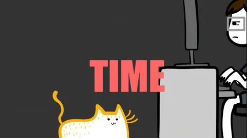

# Hey there! I'm Eleonor (Ellie) Menéndez 🐇

## Quick Links
🦋 [Bluesky](https://bsky.app/profile/eleonor.me) - 🌐 [Blog](https://eleonor.me) - 🔗 [LinkedIn](https://www.linkedin.com/in/eleonor-me)

## About Me
_"Code is poetry, and poetry has no boundaries."_

🎹 Piano Player | 🎮 Gamer | 🎵 Music Addict | 🚀 Entrepreneur | 🧠 Neurodivergent | 📚 Hobbyist Philosopher

I currently split my time between **running [Astrava Entertainment](https://astrava.games)** and building resilient, positive social impact in the Canary Islands games scene by working as a board lead with [**ACADEVI**](https://acadevi.es) running events, game jams and community programmes.

### 🌌 Astrava Entertainment - Collective Games Development & Social Lab 
Astrava is our tech collective for building an alternative model in the games industry. Things we do:

- 🌍 **Social Impact**: tech & games for positive change in underrepresented sectors  
- 🧪 **R&D**: experimentation with future technologies
- 🛠️ **Open Source Tools**: giving back to the community
- 🎮 **Games Development**: Developing unique IP's

### 🛠️ My Stack
- **Programming Languages:** JavaScript, TypeScript, Python, C++, C#, Dart, Java, PHP, Rust  
- **Human Languages:** Spanish, English, Dutch  
- **Web Technologies:** React, Vue.js, Node.js, Express.js, WordPress  
- **Tools:** My keyboard  
- **Game Engines:** Unreal Engine, Unity, Godot, Scirra Construct, RPG Maker  
- **Databases:** MariaDB, MySQL, PostgreSQL, MongoDB, Firebase  
- **Text Editors / IDEs:** WebStorm, PhpStorm, Android Studio, CLion, Rider, DataGrip, PyCharm Professional, Fleet, Pulsar (sorry, Visual Studio)  
- **Tabs or Spaces:** I prefer tabs, but can always work with spaces  
- **Bracket Preference:** A combination of Allman style and K&R for lambdas — it works for my brain  
- **IDE Theme:** Dracula (most developers will agree it’s the best dark theme)  
- **Methodologies:** Design Thinking, Agile/Scrum, Waterfall  
- **Project Management:** Sunsama, Notion, GitKraken  
- **Extra tricks:** Will outplay your Stellaris empire  
- **Favourite Games:** Golden Sun, Castlevania: Lords of Shadow, State of Decay 2, Stellaris, The Medium, Oxygen Not Included, Company of Heroes, Baldur's Gate 3, Battle for Wesnoth

### 🚀 Software Built
- **CRM Web App:** for the South East London Chamber of Commerce  
- **Particle Simulation Engine:** for the web with Pixi.js  
- **Blackheath Village App:** Android & iOS app, serving up to ~530 concurrent users/day  
- **Blackheath Village Local Manager:** a custom CMS for enterprise businesses  
- **Blackheath Village:** web application built with Vue.js  
- **Boolean Algebra Decision Table Plugin:** for Unreal Engine 4  
- **Biometric University Degree Verification System:** two mobile apps, one Express.js backend and one PWA  
- **Rebirth: The Rise of a Hero:** my first video game  
- **Discordabat:** an RTS built in a week. Winner of the 2012 UCV Game Dev Contest  
- **Game Jams:** Home It Crab, Fight to the Light, Spirit Trap  
- **Toy Compiler:** formula-based calculator with an AST and recursive descent parser  
- **Sparklysmile Dental Website:** design overhaul  
- **Haven VCS:** the future of storage for creatives  
- **Terrero & Gloria Play:** the official wrestling app for Canary Islands sports  
- **One Chamber:** a complete WordPress solution with a full-fledged CRM built for the South East London Chamber of Commerce  
- **Lots of WordPress websites:** lost count!

### :chart_with_upwards_trend: My Wakatime Stats

Keep coding magically! ✨

Cogito, ergo sum. 🤖
