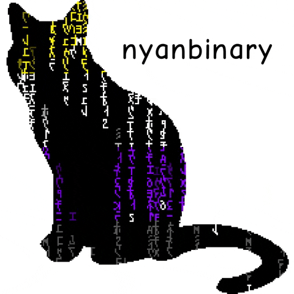

# Hey there! 👋 I'm Ellie Menéndez :v: A Senior Full Stack Software Developer

## About Me
_"Code is poetry, and poetry has no boundaries."_

🎹 Piano Player | 🌈 Transgender | 🥋 Wushu Enthusiast | 🎮 Gamer | 🤘 Goth | 🎵 Music Addict | 🚀 Entrepreneur | 🧠 Neurodivergent | 📚 Hobbyist Philosopher

I waltz through the intricacies of severe hyperactive **ADHD** and my melodic aversion to certain sounds (a.k.a. mysophonia). The former occasionally choreographs a delayed processing speed, a quirky feature beyond my control. So, when the technical assessment spotlight shines, I humbly ask for your understanding and a tad more time. Your virtuoso patience is sincerely cherished. 🎶✨

### 🛠️ Skills
- **Programming Languages:** JavaScript, TypeScript, Python, C++, C#, Dart, Java, PHP
- **Human Languages:** Spanish, English, Dutch
- **Web Technologies:** React, WordPress, Node.js, Vue.js, WordPress, Express.js
- **Tools:** My keyboard
- **Game Engines:** Unreal Engine, Unity, Godot, Scirra Construct, Rpg Maker, Meta Spark Studio
- **Databases**: Mariadb, MySQL, Postgress, Mongo, Firebase
- **Text Editors:** Webstorm, PHPStorm, Android Studio, CLion, Rider, DataGrip, Pycharm Professional, Fleet, Pulsar (Sorry Visual Studio)
- **Tabs or Spaces:** I use Tabs with 2 blank spaces
- **Bracket Preference:** A combination of Allman Style with K&R for Lambdas works for my brain, not against
- **IDE Theme:** Dracula (most developers will agree that it's the best dark theme)
- **Methodologies:** Design Thinking, Agile/Scrum, Waterfall
- **Project Management:** Sunsama, Notion, Gitkraken
- **Extra tricks:** AR/VR development, Games Design, MQTT, Discord bots, will outplay your Stellaris empire
- **Favourite Games:** GoldenSun, Castlevania Lords Of Shadow, State of Decay 2, Stellaris, The Medium, Oxygen Not Included, Company of Heroes, Night of the Full Moon, Battle for Polytopia, Baldur's Gate 3, Battle For Wesnoth

### 🚀 Software Built
- **CRM Web App:** for the South East London Chamber Of Commerce
- **Particle Simulation Engine:** for the web with Pixi.Js
- **Blackheath Village App:** for Android and iOS, serving up to 530 concurrent users per day
- **Blackheath Village Local Manager:** A custom CMS for enterprise businesses
- **Blackheath Village:** Web application built with Vue.js
- **Boolean Algebra Decision Table Plugin:** for Unreal Engine 4
- **Biometric University Degree Verification System:** 2 mobile apps, one backend with Express.js and one PWA
- **Rebirth, The Rise of a Hero:** My first video game
- **Discordabat:** An RTS built in a week, winner of the 2012 UCV Gamedev Contest
- **Game Jams:** Home it crab, Fight to the light, Spirit Trap
- **Toy Compiler:** Formula-based calculator with an AST tree and recursive descent parser
- **Sparklysmile Dental Website:** Design overhaul
- **Lots of WordPress Websites:** Lost count!

### :chart_with_upwards_trend: My Wakatime Stats

Keep coding magically! ✨

Cogito, ergo sum. 🤖
